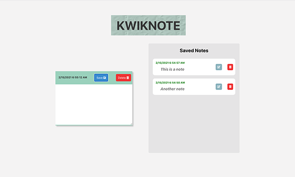

# Kwik Note

An easy to use note app that stores your notes for later use. This web app was built with [React](https://reactjs.org/)

<h1 align="center">

</h1>

### Demo

This is the working [demo](https://julianehiem.github.io/kwik-notes/)

## Built with

- [HTML](https://developer.mozilla.org/en-US/docs/Web/HTML)
- [CSS](https://developer.mozilla.org/en-US/docs/Web/CSS)
- [JS](https://developer.mozilla.org/en-US/docs/Web/JavaScript)
- [React](https://reactjs.org/)

### Some other libraries and Apis used

- React [Context-Api](https://reactjs.org/docs/context.html)
- [Immer](https://github.com/immerjs/immer)

### This project was inspired by this [repo](https://github.com/florinpop17/app-ideas/blob/master/Projects/1-Beginner/Notes-App.md)

## License

This project is licensed under the terms of the **MIT** license.
MIT © [JulianEhiem](https://github.com/JulianEhiem)